#首页
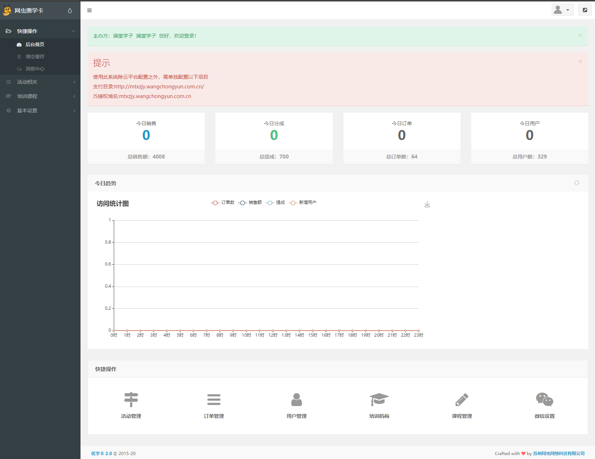
#培训课程
##培训机构-列表页
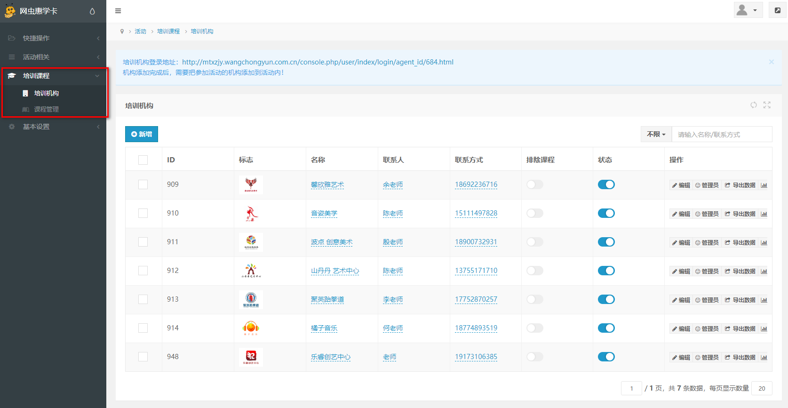
##培训机构-新增
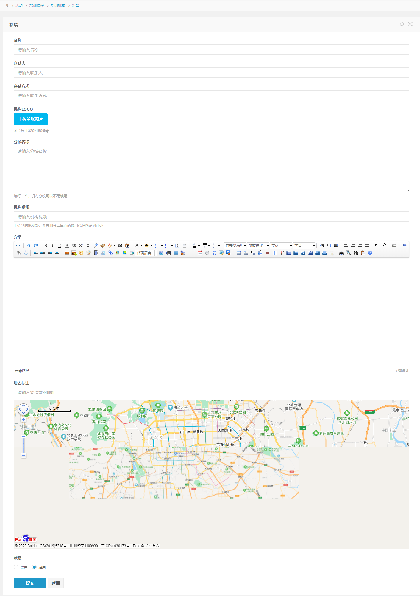
##培训机构-编辑
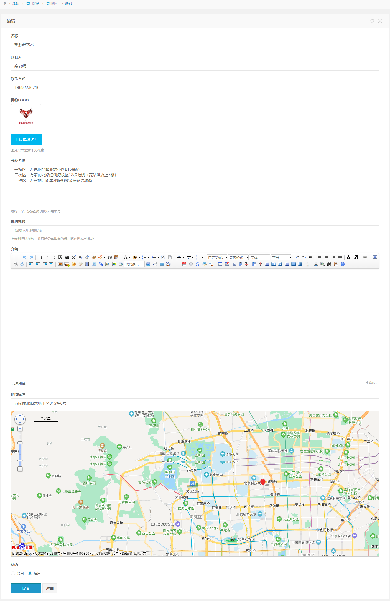

##课程管理-列表
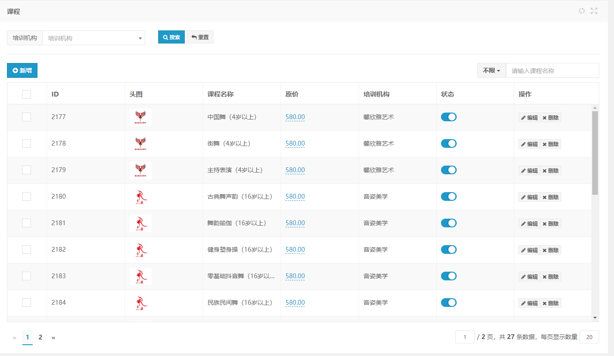
##课程管理-新增
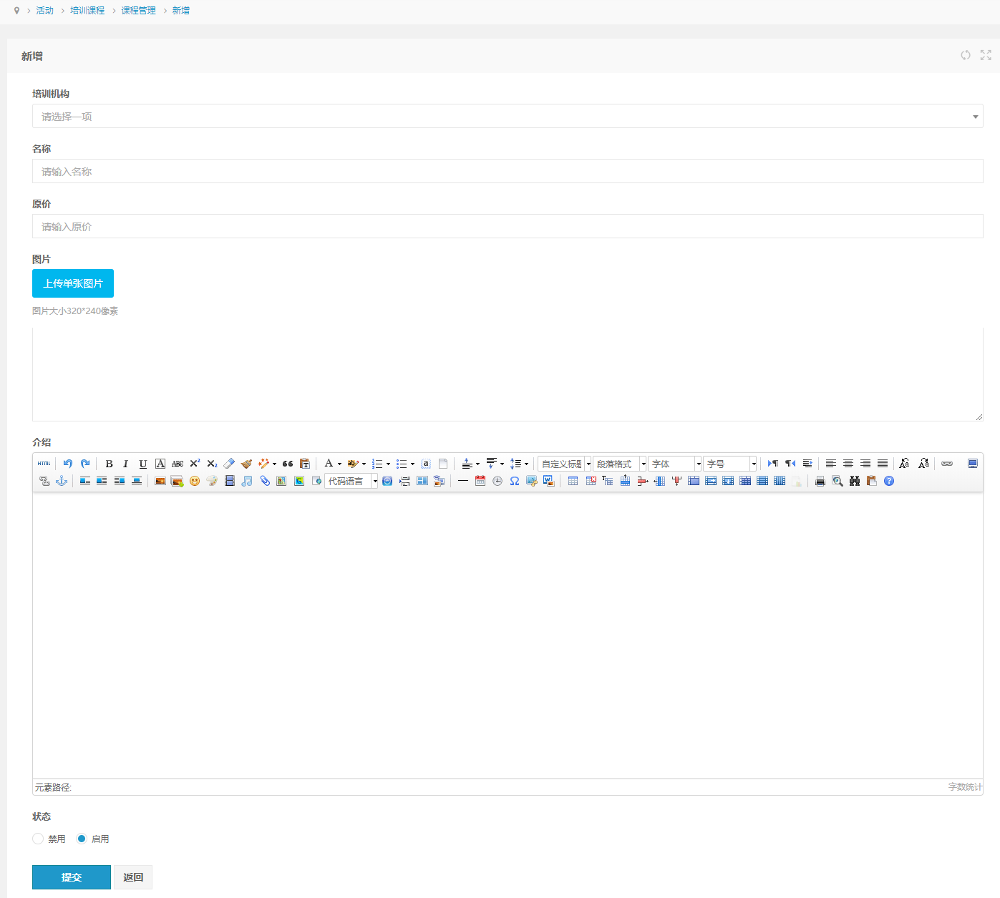
##课程管理-编辑
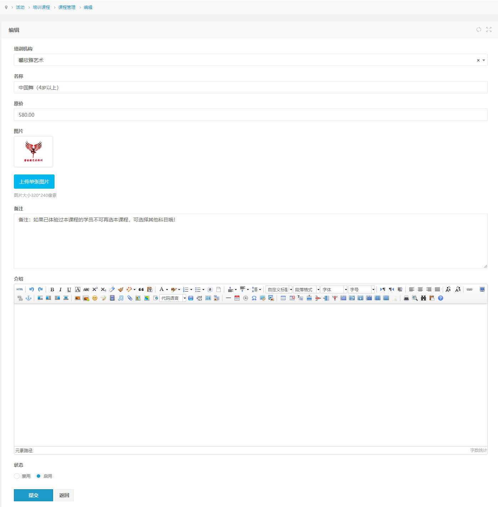

#活动相关
##活动管理-列表
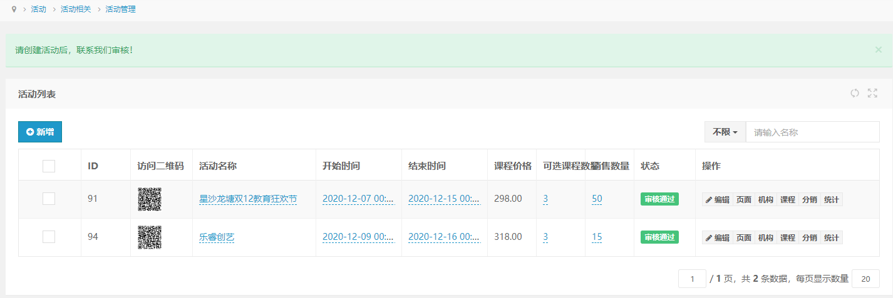
##活动管理-新增
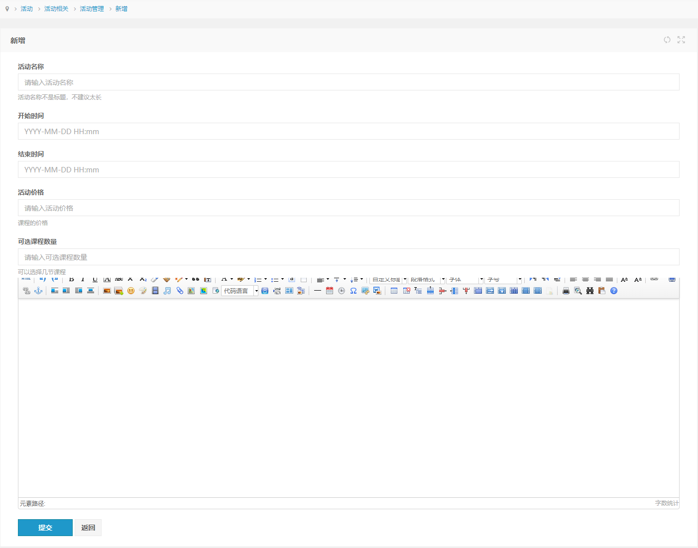
##活动管理-编辑
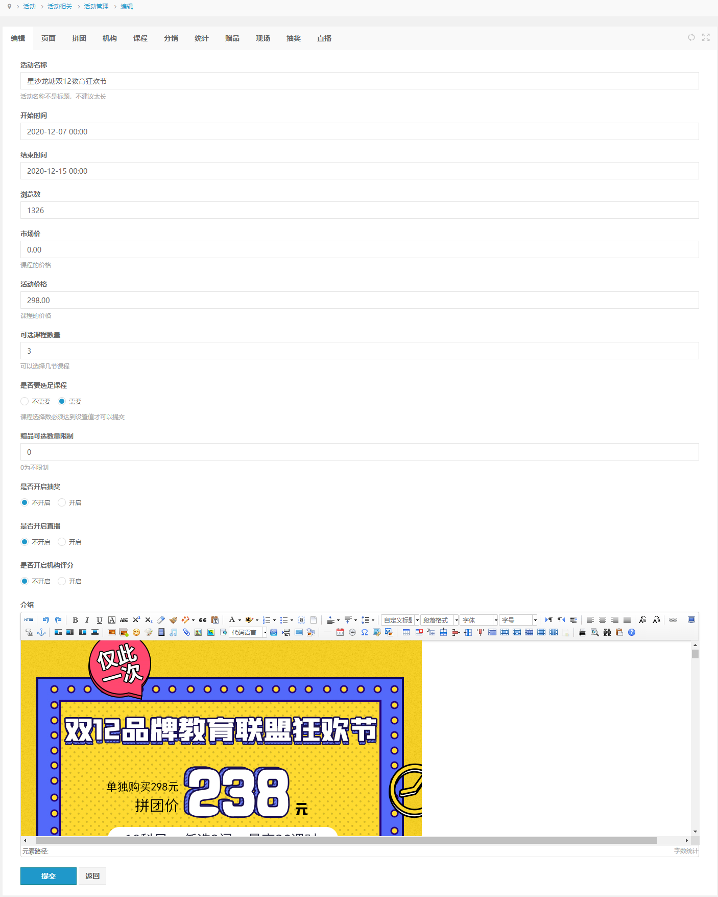
##活动管理-页面

##活动管理-拼团
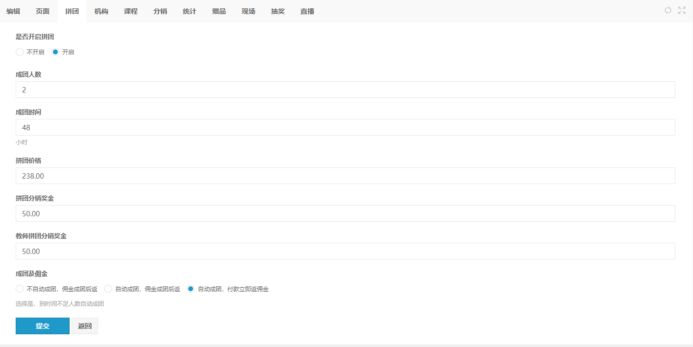
##活动管理-机构
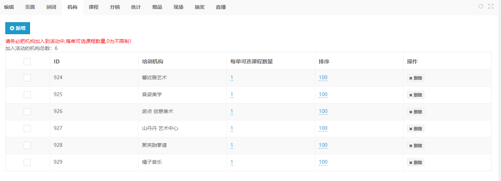
##活动管理-课程
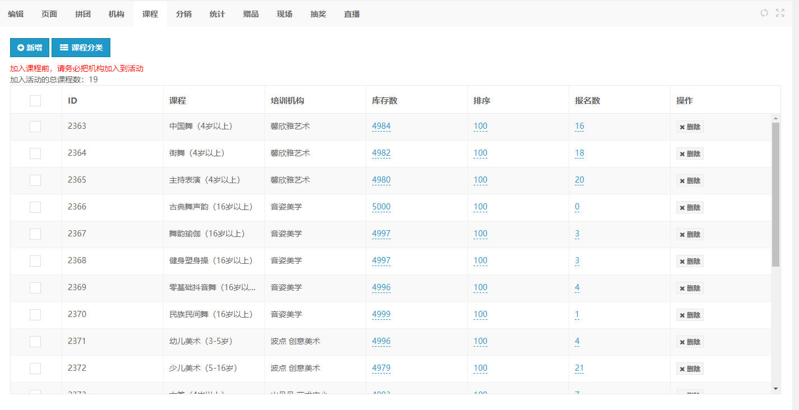
##活动管理-分销
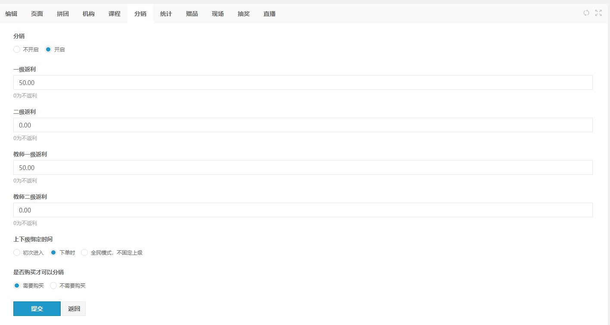
##活动管理-统计
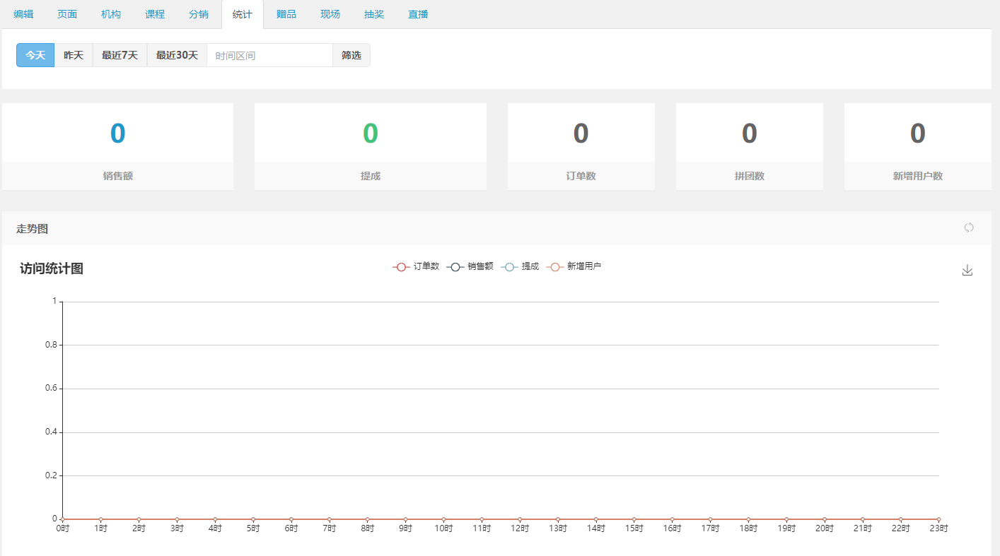
~~##活动管理-赠品~~
##活动管理-现场
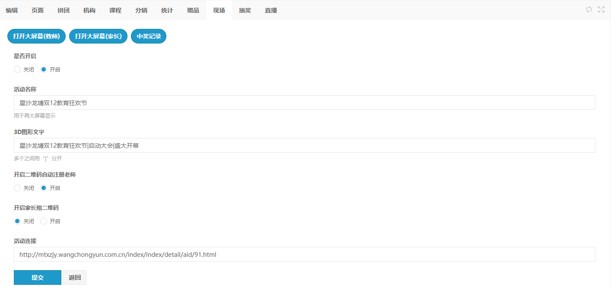

